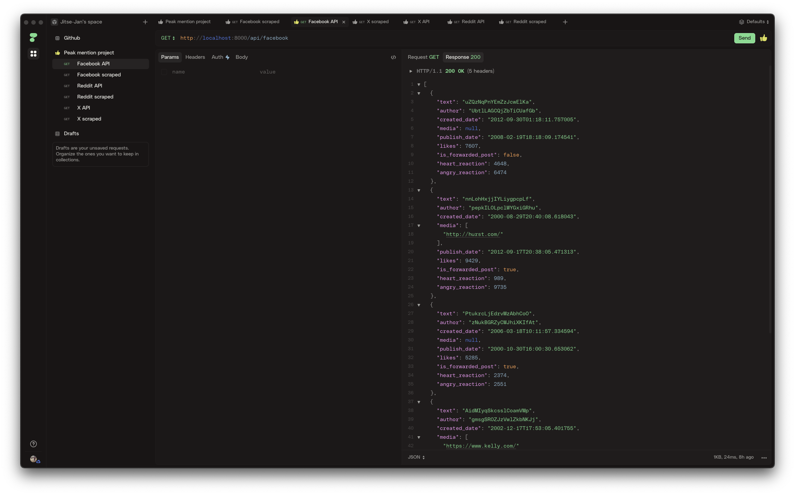

# peak-mentions
A robust, local data pipeline using modern Python data engineering tools.

## Virtual environment
To run this project the package manager [Rye](https://rye.astral.sh) is used. To activate the virtual environment on Mac for fish shell, run the following:

```sh
$ cd peak-mentions
$ rye sync
$ . ./.venv/bin/activate.fish 
```

## Project setup
- Data generation ([fastapi](https://fastapi.tiangolo.com) + [polyfactory](https://polyfactory.litestar.dev/latest/)). 
- Data ingestion  ([dlt](https://dlthub.com))
- Orchestration ([dagster](https://dagster.io))
- Data transformation ([dbt](https://www.getdbt.com))
- Testing ([pytest](https://docs.pytest.org/en/stable/))

For storage [DuckDB](https://duckdb.org) is used as local database.

## Data generation
For the data generation six endpoints are created with FastAPI. The three sources are for:

- Facebook
- Reddit
- X

and for each source there are two endpoints:

- api
- scraped

The data from the api is structured where the scraped endpoints return semi-structured data. The endpoints are defined under `api/endpoints`.



Based on the schema description different models are created under `api/models` for the three different sources and two factories for each to create both the structured and unstructured data under the `api/factories` folder.

Finally, the server to expose the API is defined in `api/main.py` and includes routers to the endpoint. All the endpoints will trigger the data factory and create dummy data to be consumed.

### Run server
To run the server the following command is used:

```bash
$ uvicorn src.peak_mentions.api.main:app --reload
```

Or alternatively, use the `fabfile.py` with the command:

```bash
$ fab run-fastapi
```

