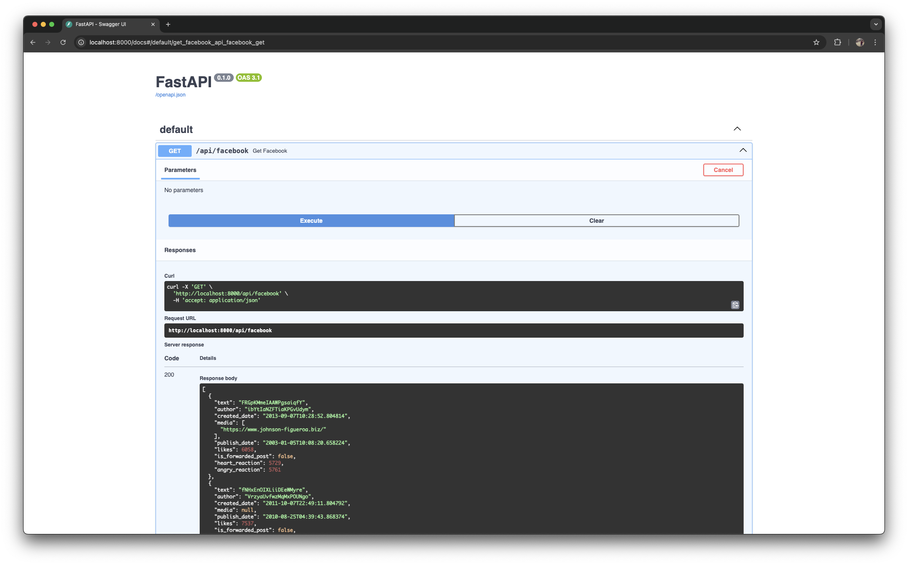

# peak-mentions
A robust, local data pipeline using modern Python data engineering tools.

## Virtual environment
To run this project the package manager [Rye](https://rye.astral.sh) is used. To activate the virtual environment on Mac for fish shell, run the following:

```sh
$ cd peak-mentions
$ rye sync
$ . ./.venv/bin/activate.fish 
```

## Project setup
- Data generation ([fastapi](https://fastapi.tiangolo.com) + [polyfactory](https://polyfactory.litestar.dev/latest/)). 
- Data ingestion  ([dlt](https://dlthub.com))
- Orchestration ([dagster](https://dagster.io))
- Data transformation ([dbt](https://www.getdbt.com))
- Testing ([pytest](https://docs.pytest.org/en/stable/))

For storage [DuckDB](https://duckdb.org) is used as local database.

## Data generation
For the data generation six endpoints are created with FastAPI. The three sources are for:

- Facebook
- Reddit
- X

and for each source there are two endpoints:

- api
- scraped

The data from the api is structured where the scraped endpoints return semi-structured data. The endpoints are defined under `api/endpoints`.

Based on the schema description different models are created under `api/models` for the three different sources and two factories for each to create both the structured and unstructured data under the `api/factories` folder.

Finally, the server to expose the API is defined in `api/main.py` and includes routers to the endpoint. All the endpoints will trigger the data factory and create dummy data to be consumed.

### Running the server
To run the server the following command is used:

```bash
$ uvicorn src.peak_mentions.api.main:app --reload
```

Or alternatively, use the `fabfile.py` with the command:

```bash
$ fab run-fastapi
```

### Querying the data

The data can now be queried locally on `localhost:8000/`. Explore the API by navigating to `http://localhost:8000/docs` and try the endpoints:



Or use an API client to explore the data:


## Data ingestion

To load data from the endpoints created in the previous step the ingestion package `dlt` is used. For each source (Facebook, Reddit, X) a connector is build where the different endpoints (resources) are defined. The data is loaded into a DuckDB Database.

### Running the ingestion
In order to execute the ingestion job, run the following command:

```bash
$ python src/peak_mentions/connectors/dlt_pipeline.py
```

Or alternatively, use Fabric again:

```bash
$ fab ingest-all
```

### Validating the data

After running the ingestion, the data can be validated using the DuckDB UI (or loaded into most popular database viewers).

Running

```bash
$ duckdb --ui mentions_pipeline.duckdb
```

will open a browser with the DuckDB interface that contains a table viewer and a notebook environment.


Alternatively, run the following to get the UI:

```bash
$ fab duckdb-ui
```

## Data transformation

To transform the data from its raw shape to useful data the transformation tool `dbt` is used. The first step is to read in the raw data from the database, then combine the different sources in facts and dimensions and finally into aggregates or other insights.

The dbt project lives in the root folder under `dbt_project` which contains the models, the `dbt_project.yml` and the `profiles.yml`. The `dbt_project.yml` contains the settings for the project. The `profiles.yml` has the different targets for the project which would be in this case a DuckDB instance.

The models are divided by `staging`, `dim` and `fct`. The `staging` layer retrieves all the raw data and ensure data is in the right format. There are 6 staging models corresponding to the 6 endpoints, and an additional `stg_mentions` that combines the data from the different models into a single model. The `dim` folder contains a author and platform dimension and under the `fct` folder the top URLs are calculated as well as the author likes daily.

### Running the transformation

To run the dbt transformation, execute:

```bash
$ fab dbt-build
```

This will first calculate the 6 staging models for the endpoints, then calculate the mention table in staging and finally calculate the dimension and fact tables.

### Validating the transformation

Once dbt has run, the tables are created and can be queried through the DuckDB console or UI. To visualise the data the dbt docs can be used.

First generate the docs with:

```bash
$ fab generate-docs
```

followed by

```bash
$ fab serve-docs
```

which will open the browser with the overview of the project.

.

Through the docs the lineage can be visualised:

.

This shows that the fact table used the stg_mentions table which in turn is using all the staging tables.

## Orchestration

To orchestrate the different part of the ETL pipeline Dagster is used. Dagster supports operations and assets which can be turned into pipelines and dependencies. For example, the data extraction should happen before the data modelling is done. 

The Dagster project is found under `dagster_project` and has assets, jobs, resources and a `repository.py`. The last one is the core of the pipeline and defined the other elements. Under assets the dbt assets are defined which links to the actual dbt project and its corresponding manifest file. There are two resources respectively `dbt` and `dlt`. The `dlt` extraction is done through a normal 'op' job which is a chain of normal operations and `dbt` is ran as an asset job. The latter deals better with data, especially if it is moving between steps in the pipeline. 

To run the `dlt` extraction through Dagster, use:

```bash
$ fab run_dlt
```

and for `dbt`:

```bash
$ fab run_dbt
```

This will ingest the data again from the endpoints and then create some derived tables through dbt. 

## Future improvements

- Use dotenv for defining variables rather than hardcoding them in the Python files.
- Add proper tests around the different parts of the pipeline. pytest for the API connectors, dbt test and dbt expectations for the actual data validation.
- Chain the dlt and dbt steps in Dagster together by converting dlt to an asset job. Currently ops and assets don't work well together but ideally it is one flow the dependency handling is much more scalable. 
- Use Dagster UI better to surface the data at different parts in the pipeline.
- Introduce pre-commit with pytest, pylint, black, and other similar Python checks
- Actual implementation on a cloud provider. Probably deploying containers on Kubernetes for Dagster.
- Add logging across the whole code base.
- Enhanced monitoring of the pipelines. 